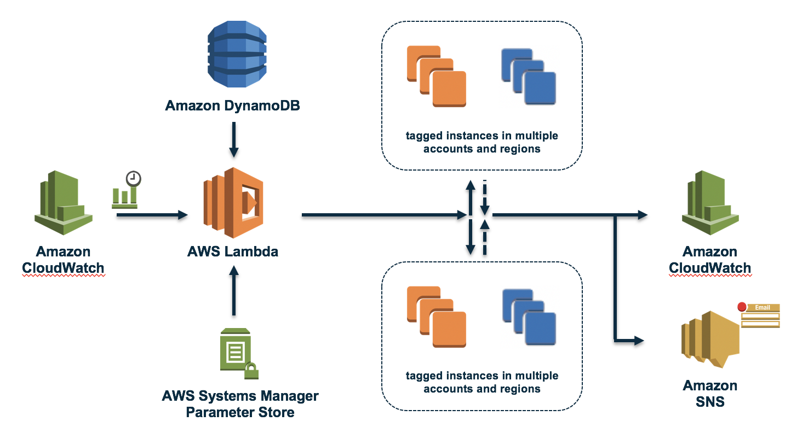
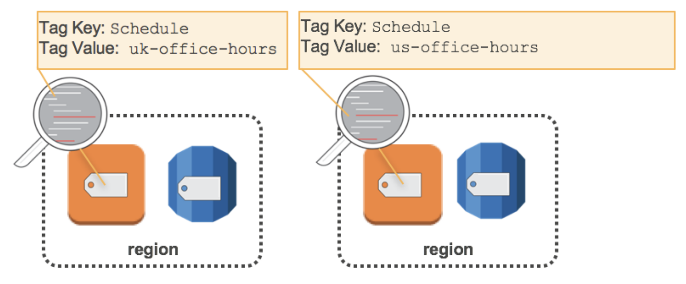
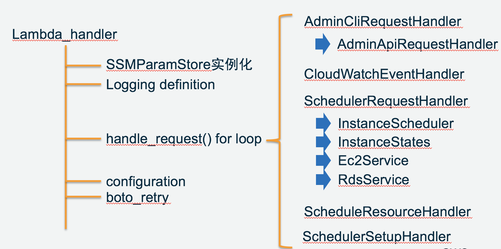

# AWS Instance Scheduler In China regions

在AWS中国区域，通过AWS Lambda实现实例的自动化调度，以优化资源使用成本和简化管理。

## 1，为什么要实现实例自动化调度？

AWS按需提供基础架构，以便客户可以控制其资源容量并仅为其使用的资源付费。降低成本的一种简单方法是停止未使用的资源，然后在需要时再次启动这些资源。但是当客户存在大量这类资源，或者需要在多个区域（如：北京和宁夏区域）甚至跨多个帐户进行统一管理这些资源时，对管理员来说将是一个非常繁琐的工作。

[AWS Instance Scheduler](https://aws.amazon.com/cn/answers/infrastructure-management/instance-scheduler/)是一种自动启动和停止Amazon Elastic Compute Cloud（Amazon EC2）和Amazon Relational Database Service（Amazon RDS）实例的解决方案。本项目以AWS Instance Scheduler方案为核心，针对中国区域的实际情况，进行了补充和修改，以便在北京和宁夏区域可以直接部署和使用。

实例调度程序将利用AWS资源标记和AWS Lambda在客户定义的调度计划中跨多个AWS区域和帐户自动停止和重新启动实例。 （请注意，停止Amazon EC2实例与终止Amazon EC2实例不同。默认情况下，Amazon EC2实例配置为在关闭时停止，而不是终止，但客户可以修改此行为。在使用此解决方案之前，请验证实例已合适设置为停止或终止。）该解决方案易于部署，有助于降低运营成本，简化运维工作量。例如，组织可以使用生产环境中的Instance Scheduler在工作时间之外每天自动停止实例。对于使所有实例完全运行的客户而言，此解决方案可以为那些仅在正常工作时间内需要的实例（每周利用率从168小时减少到50小时）节省高达70％的成本。
请注意，由于该实例调度程序使用了AWS Lambda和Amazon DynamoDB，你需要负责运行实例调度程序时使用的AWS服务的成本。

## 2，方案架构
。

通过以客户定义的时间间隔设置Amazon CloudWatch事件。此事件调用Instance Scheduler的AWS Lambda函数。在配置期间，用户定义AWS区域和帐户，以及Instance Scheduler将用于将调度计划与适用的Amazon EC2和Amazon RDS实例相关联的自定义标签。这些值存储在Amazon DynamoDB中，Lambda函数每次运行时都会检索它们。然后，客户将自定义标签应用于适用的实例。

在Instance Scheduler的初始配置期间，将定义用于标识适用的Amazon EC2和Amazon RDS实例的标签键。创建计划时，您指定的名称将用作标签值，用于标识要应用于标签资源的调度计划。例如，用户可以使用解决方案的默认标签键Schedule并创建一个名为uk-office-hours的调度计划。要识别将使用英国办公时间计划的实例，用户会将Schedule标签键添加uk-office-hours值。如图所示：

每次实例调度程序的Lambda函数运行时，它会根据相关计划中的目标状态（由实例标签中的计划中的一个或多个句点定义）检查每个适当标记的实例的当前状态，然后在必要时执行适当的启动或停止活动。

例如，如果在周五上午9点调用Lambda函数，并且它使用Schedule = cn-office-hours标签标识已停止的Amazon EC2或Amazon RDS实例，则它将检查Amazon DynamoDB的办公时间计划配置的细节。 如果办公时间计划包含一个周期规则，指示该实例应在周一至周五从上午9点到下午6点运行，则Lambda函数将启动该实例。

由于中国区域目前不支持Lambda函数的环境变量特性，本方案使用AWS Systems Manager的参数仓库（Parameter Store）存放Lambda函数的环境参数，如Lambda函数运行时访问DynamoDB的表名称。

AWS Systems Manager 提供一个集中式存储来管理配置数据，支持数据库字符串等纯文本数据或密码等保密数据。这让您能够将保密数据和配置数据与代码分开。您可以标记参数并将其整理成不同的层级，这有助于您更轻松地管理参数。例如，您可以将同一参数名称 (“db-string”) 与不同的层级路径 (“dev/db-string”或“prod/db-string”) 结合使用，用于存储不同的值。此外，您还可以使用 AWS Identity and Access Management (IAM) 控制用户和资源对参数的访问权限。参数可以通过 Amazon Elastic Container Service、AWS Lambda 和 AWS CloudFormation 等其他 AWS 服务引用。

## 3，实现细节
[**定义IAM角色和策略**]

这里要为Lambda和CloudWatch Events授予相应的访问权限，例如Lambda函数执行中需要读DynamoDB调度计划配置表、写DynamoDB状态表，读取资源标记，启动、停止实例等。详细权限信息可参考[部署模版](instance-scheduler-cn.template)中权限部分的定义。

[**构建Lambda函数及相关服务配置**]

给出Lambda函数的核心结构：。

其中，handle_request部分为核心处理逻辑，这里根据处理类型的不同，封装了几个Handler类，分别处理来自CloudWatch Event、调度器初始化设置、管理CLI的计划配置请求和实例调度请求，实例调度请求将按照账户、区域和调度种类（EC2/RDS）进行分层处理。

这部分涉及到的DynamoDB配置表和状态表、SNS Topic/Subscription、CloudWatch Log Group及Parameter Store参数的创建相对比较简单，这里就不再赘述。更多信息可参考[部署模版](instance-scheduler-cn.template)中相应部分的定义。

一个复杂的程序经常需要在很多模块文件中读取和使用不同的参数，因此，为了避免在不同地方重复编写雷同的代码，有必要将Lambda函数中对其它服务的API访问进行封装。这里参照面向对象的设计思想，以对Parameter Store API的访问为例，根据访问逻辑对参数集对象进行封装并定义相应的类，以方便其它地方复用。

封装的Paramter Store类定义如下：

```python
class SSMParamStore(object):
    """
    Provide a dictionary-like interface to access AWS SSM Parameter Store
    """
    def __init__(self, prefix=None, ssm_client=None, ttl=None):
        self._prefix = (prefix or "").rstrip("/") + "/"
        self._client = ssm_client or boto3.client('ssm')
        self._ttl = ttl
        ...

    def get(self, name, default=None):
        ...
        abs_key = "%s%s" % (self._prefix, name)
        if name not in self._keys:
            self.errormsg = "get error: Key not exist!"
            return default
        ...
        else:
            return self._get_value(name, abs_key)

    def put(self, key, value):
        assert key, 'Key can not be empty!'
        abs_key = "%s%s" % (self._prefix, key)
        try:
            response = self._client.put_parameter(
                Name=abs_key,
                Value=value,
                Overwrite=True,
                Type='String'
            )
            ...

    def put_secure(self, key, value, kmsKeyId=None):
        assert key, 'Key can not be empty!'
        abs_key = "%s%s" % (self._prefix, key)
        try:
            if kmsKeyId is None:
                response = self._client.put_parameter(
                    Name=abs_key,
                    Value=value,
                    Overwrite=True,
                    Type='SecureString'
                )
            ...

    def delete(self, name):
        ...
        abs_key = "%s%s" % (self._prefix, name)
        ...
        else:
            resp = self._client.delete_parameter(Name=abs_key)
            self._keys.pop(name,None)
            return resp

    def refresh(self):
        ...
        while not end_of_rec:
            if not nextToken:
                responses = self._client.describe_parameters(
                    ParameterFilters=[
                        dict(Key="Path", Option="Recursive", Values=[self._prefix])
                    ]
                )
            else:
                responses = self._client.describe_parameters(
                    NextToken=nextToken,
                    ParameterFilters=[
                        dict(Key="Path", Option="Recursive", Values=[self._prefix])
                    ]
                )
            ...

    def _get_value(self, name, abs_key):
        ...
        if 'value' not in entry:
            parameter = self._client.get_parameter(Name=abs_key, WithDecryption=True)['Parameter']
        ...
        return entry['value']
```
这样，在Lambda函数中当需要访问Parameter Store中的参数时，通过以下调用就可以方便获取所需的参数：

```python
import ssm_paramstore
from ssm_paramstore import SSMParamStore

#set parameterstore path prefix and get the handler to
ssmPrefix = "/lambdaEnvConfig/InstanceSchedulerMain"
ssm_paramstore.conf = SSMParamStore(prefix=ssmPrefix)

...
debug = ssm_paramstore.conf.get(configuration.ENV_TRACE,'False')
...
```

[**创建CloudWatch的Event规则**]

完成前面步骤后，这一步就非常简单了，只需要在CloudWatch控制台中创建Event Rule，并指定自定义时间间隔，然后将上面创建的Lambda函数加到Target中就好了。

## 4，部署模版
为了简化实例调度程序的部署，这里给出了可以在中国区域使用的AWS CloudFormation json格式模版，你可以直接通过模版快速部署上述实例自动调度方案。
共包括两个模版：
- [**在管理账户中执行的模版**](instance-scheduler-cn.template)

- [**在被管账户中执行的模版**](instance-scheduler-remote-cn.template)

同时，请将aws-instance-scheduler目录复制到相应的S3 Bucket下面。

注意：如果使用跨账户管理实例调度，请将被管账户模版执行结果role ARN填写到管理账户模版执行的输入参数cross account role ARN中，多个ARN以逗号分隔。

## 5，使用说明
两个简单步骤：
- 在DynamoDB的xxx-ConfigTable-xxx中参照缺省计划定义你的period和schedule。其中，period是用于定义时间段或周期信息，schedule定义调度计划信息。 这里也提供了CLI接口程序包，你可以将schedule-cli.zip下载到本地安装，通过cli接口配置和定义调度计划，具体命令格式可执行scheduler-cli -h查看
- 为需要管理的实例打标签，格式如Schedule = cn-office-hours，其中cn-office-hours就是你定义的schedule的名称


**schedule定义支持的属性**

| 属性名称 | 说明 |
|:--------------|----------------------------------------------------------------------------------|
|name|Unique Name，用做tag value，标识作用于被标记资源的schedule|
|type|标识此item为schedule|
|timezone|Time Zone。如果不指定，采用config中的缺省时区|
|periods|一个或多个period，定义实例的运行时间。当有多个时，至少一个满足条件|
|enforced|强制保持schedule中定义的状态|
|retain_running|保持运行状态，即如果在period之前启动了实例，那么在period结束时间点不自动停止|
|override_status|临时重载启停活动，即如果设置为running，将不会自动停止实例；如果设置为stopped，将不会自动启动实例。如果同时指定了enforced属性，enforced优先|
|\<period-name\>@\<instance-type\>|可选，只针对EC2实例。当针对一个period指定实例类型时，将自动按照指定实例类型启动被标记实例。如果运行中实例的类型不同于period指定的类型，将停止当前实例并按照指定实例类型重新启动(Resizing要求指定的实例类型与当前类型兼容)|
|use_maintenance_window|只针对RDS实例。选择是否将RDS维护窗口作为一个running period加到schedule中|
|use_metrics|选择是否在schedule级别enable CloudWatch metrics，它会重载config级别的设置|


**period定义支持的属性**

|属性名称|说明|
|:--------------|----------------------------------------------------------------------------------|
|type|标识此item为 period|
|begintime|启动实例的时间点(HH:MM)。如果未指定endtime，但指定了weekdays，将通过weekdays确定停止时间点。例如weekdays指定mon-fri，则实例将在周五的11:59 pm被停止|
|endtime|停止实例的时间点(HH:MM)。如果begintime和endtime都未指定，将使用weekdays, monthdays, months来确定启停时间点|
|weekdays|指定一星期中在哪些天实例将运行。可以是列表(mon,fri)，范围(mon-fri)，一个月中第n个(mon#1)，一个月中最后一个(friL)|
|monthdays|指定一个月中在哪些天实例将运行。可以是列表(1-7,10,20)，范围(1-30)，每n天(1/5,1-15/2)，最后一天(L)，离指定日期最近的工作日(25W)|
|months|指定那几个月实例将运行。可以是列表(1,6,9,12)，范围(1-6)，每n个月(Jan/3, Jan-Jul/2)|

注意：
- 如果一个schedule包含多个period，建议同时指定begintime和endtime，否则将根据其它period中指定的时间来决定启停时间点。
- 必须至少指定以下几个属性中的一个：begintime, endtime, weekdays, monthdays, months
- 当一个period中包含多个条件时，所有条件必须为true


